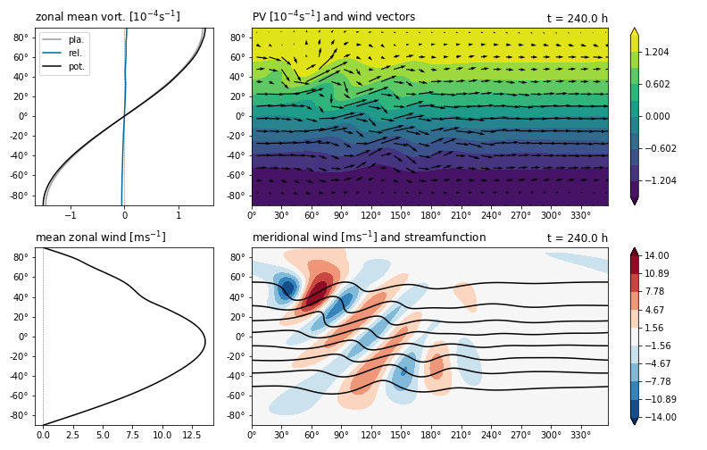

# barotropic

A framework for barotropic analysis and modelling of the atmosphere.


## Features

- Integration of the barotropic PV equation on the sphere. 
  Fields are represented on a regular latitude-longitude grid while spatial derivatives are evaluated in spectral space (spherical harmonics).
  The model uses a leapfrog time integration scheme with Robert-Asselin filter, initialized with an Euler-forward step.
- A range of diagnostic functions to investigate properties of the flow and extract features, e.g. Rossby wave packets.
- Predefined plotting functions, initial condition presets and forcing terms.

The package is object-oriented, modular and easy to use.
The implementations are kept simple but sufficiently fast to allow interactive use at moderate spatial and temporal resolutions (e.g. 2.5° spatial resolution with 10 minute timesteps).
A simulation can be set up, run and visualized in under 10 lines of code, e.g.:

```python
import barotropic as bt

grid    = bt.Grid(resolution=2.5)
initial = bt.init.solid_body_rotation(grid, amplitude=15)
forcing = bt.rhs.GaussianMountain(center=(30, 45), stdev=(10, 10), height=2000)
model   = bt.BarotropicModel(forcing, diffusion_order=2)

last, all_states = model.run(initial, 15*bt.MIN, 10*bt.DAY, save_every=6*bt.HOUR)

last.plot.summary()
```



Consult the [online documentation](https://chpolste.github.io/barotropic/build/html) to learn more about features and how to use the package.
Note that the API has changed substantially with the release of version 3 in Feb 2022.
Version 2 will remain accessible from the [master](https://github.com/chpolste/barotropic/tree/master) branch for a while longer, while development continues on the new main branch.


## Installation

barotropic is available on PyPI:

    $ pip install barotropic

Dependencies:

- [numpy](https://github.com/numpy/numpy)
- [scipy](https://github.com/scipy/scipy)
- [pyspharm](https://github.com/jswhit/pyspharm)
- [matplotlib](https://github.com/matplotlib/matplotlib) (optional)
- [PyWavelets](https://github.com/PyWavelets/pywt) (optional, >= 1.1)
- [hn2016_falwa](https://github.com/csyhuang/hn2016_falwa) (optional)


## License

Copyright 2019-2022 Christopher Polster

Licensed under the Apache License, Version 2.0 (the "License");
you may not use this file except in compliance with the License.
You may obtain a copy of the License at

http://www.apache.org/licenses/LICENSE-2.0

Unless required by applicable law or agreed to in writing, software
distributed under the License is distributed on an "AS IS" BASIS,
WITHOUT WARRANTIES OR CONDITIONS OF ANY KIND, either express or implied.
See the License for the specific language governing permissions and
limitations under the License.

